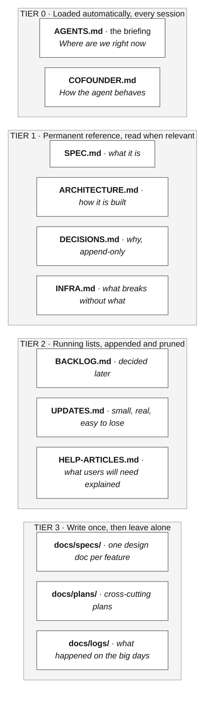
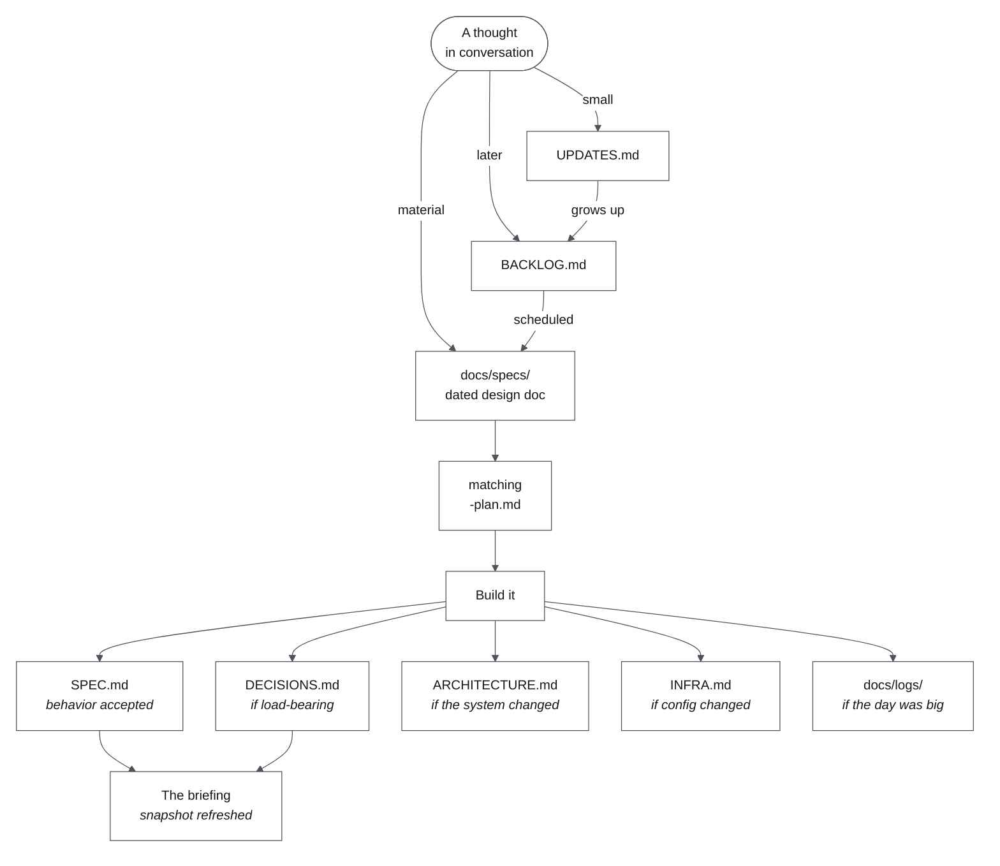
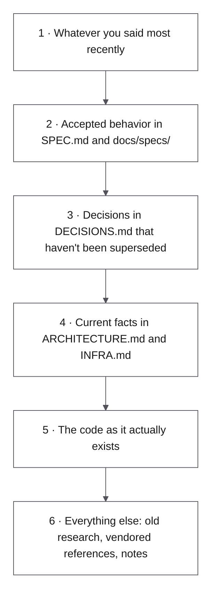

# Cofounder

Cofounder is a project harness that turns your AI coding agent into a technical cofounder:
one that remembers what you're building, has opinions about how to build it, and guides you
the way a real technical cofounder would.

It holds everything a project needs to survive being built one session at a time. A
briefing the agent reads before it touches anything. A permanent record of what you
decided and why, so nobody reopens it in six weeks. The rules for how it builds, when it
argues with you, and what it will never do without telling you first.

Copy it into your project, say "let's get started," and the agent interviews you and fills
the whole thing in.

---

## Why "Cofounder"

Have you ever thought you needed a technical cofounder before you could build anything?

They're the hardest hire in software. Rare, expensive, they want equity, and even when you
find one, the two of you working well together is luck. Most builders never get that
person.

Your agent could do that job. Out of the box it doesn't. It builds what you ask, agrees
with almost everything you say, and shows up every morning knowing nothing about what
you're building.

Cofounder changes how it thinks, not just what it knows. It sizes a request before it
starts. It builds for the stage you're actually at instead of the one you're imagining.
And it holds onto the point of the whole thing while it works.

That last one is the part people underestimate. An agent doesn't go off the rails because
it's careless. It goes off because each next step looked reasonable on its own, and so did
the one after that, and six reasonable steps later it's building something you never asked
for. It has nothing to check itself against.

Cofounder is what it checks against. What you're building and why, what you already
decided, what's deliberately out of scope, all written down and read before it starts. So
drift gets caught while it's still one step off, not six.

A cofounder tells you you're heading the wrong way. An agent that only wants to be helpful
gets you there faster.

---

## Who this is for

The product person. The business person. The person who knows an industry inside out and
can see the thing that ought to exist in it.

You don't have to be technical to start building something with an AI agent. You don't
have to be an engineer.

What you need is to know your product, or your idea, or your industry. The agent is going
to bring you real decisions: what this is for, who it's for, what's in and what's out, and
and what the smallest version is that proves it. That's the cofounder's half of the deal.
Your half is to decide.

If you're a strong engineer, you'll probably build your own version of this, and you'd be
right to. I built this one for everyone else.

---

## How your agent remembers today

Worth knowing, because it explains everything that follows.

Your coding agent has no memory between sessions. Close the window and the conversation is
gone. What survives is one file it reads automatically at the start of every session:
Claude Code reads `CLAUDE.md`, and Codex, Cursor, Copilot and Windsurf read `AGENTS.md`.

That file is the memory. All of it.

So everything you want remembered has to go in there, and you find that out the hard way.
Day one it's three lines. Then you add the decision it keeps undoing, and the convention it
keeps ignoring, and what not to touch, and the bug from last week, and the roadmap, and the
reason you said no to the obvious approach.

Now think about what you're asking one file to do. Every decision, every mistake, every
idea, the features, the roadmap, the reasons, months of a project, in a single document,
read start to finish before every single task.

Nothing about that makes sense.

So it gets enormous, half of it goes stale, and the agent gets slower and vaguer the more
you put in. The longer you work on the project, the dumber it gets. By month two you're
spending the first twenty minutes of every session re-explaining your own product to the
thing that built it.

---

## How it works

Cofounder fixes that, and the memory is the smaller half of it.

### The memory half

Instead of one giant file, there are four tiers, ordered by how often the agent reads
them. The one it reads every session is the shortest on purpose.



Each file has one job. The agent reads the short one every time and the others only when
they're relevant, so it never gets slower or dumber as the project grows.

Three things make that hold up over months:

- **Everything the agent reads costs attention.** Whatever loads at the start of a session
  competes with the actual work. Give it a novel and it does worse at the job. So one
  short file describes the present, and anything that only ever grows, like decisions and
  session logs, gets an index instead of being read front to back.
- **Stale text is worse than no text.** You'd read an old note and think "that's probably
  not true anymore." The agent won't. It'll build it. So every file says what it's in
  charge of and carries a date.
- **Decisions have to defend themselves.** If you don't write down why you chose
  something, a future session will helpfully undo it. And the part that does the real work
  isn't the decision, it's the list of what you rejected and why.

### The bigger half

One file, `COFOUNDER.md`, tells the agent how to *act*. Not what the project is, but how a
technical cofounder behaves. You're the product owner: you decide what gets built and
whether it's any good. It decides whether the build is correct, and runs the work. It
makes the technical calls instead of asking you about plumbing. It explains in
consequences, not technologies. It says what it thinks once and then builds. It sizes
every request before starting. It builds for the stage you're at, not the one you're
dreaming about. It never touches money, login, or user data without telling you. It runs
the tests, keeps the docs honest, and handles git so you never have to.

Day to day, it comes out like this. You sit down, say what you're thinking, and start
riffing with something that already knows the project. Nothing gets re-explained. It's
keeping track of the decisions, the roadmap, the structure, the lessons you learned the
hard way. All the things a normal human would keep track of.


## Why it's a folder of files and not an app

Three reasons.

**It works in any agent.** This isn't a Claude thing, even though I built it with Claude.
The briefing ships as `AGENTS.md`, which Codex, Cursor, Copilot, and Windsurf already read
on their own, and Claude Code and Gemini CLI get a two-line pointer to the same file. An
app would be one tool's app. A folder of Markdown works everywhere, and whatever comes
next will read it too.

**You can read it.** Open `COFOUNDER.md` and you'll see, in plain English, how your
cofounder thinks. No generator, nothing hidden. If you want to know why it just pushed back
on you, the reason is in a file you can open.

**You can change it.** Disagree with a rule? Edit the line. The whole idea is that you're
the authority and the files are input. Software that tells you how your cofounder should
behave would have that backwards.

---

## If someone technical asks what this is

There isn't a settled name for this category yet, which is why we started calling it a
**project harness**. An eval harness wraps a model. A wiring harness wraps a machine. A
project harness wraps a project. It's the layer between your agent and the thing you're
building.

Underneath, it's four things that already exist, combined:

| What it does | What it's called | Where it came from |
|---|---|---|
| Docs live in the project, saved alongside the code | **docs-as-code** | The Write the Docs community |
| One record per decision, never edited, only added to | **ADR** (Architecture Decision Record) | Michael Nygard, 2011 |
| A folder you copy to start a project | **repo template**, **scaffold** | GitHub template repos, `cookiecutter` |
| Deciding what an agent reads before it acts | **context engineering** | Newer, 2024 or so |

So if you need the one-liner: Cofounder is a project harness: docs-as-code and decision
records, arranged as context engineering for a coding agent.

---


## How an idea moves through it

The whole point is that a thought you had in a chat doesn't die in the chat. Here's the
path it takes.



The one rule under all of this: **the docs change in the same commit as the behavior.**
Not after. A doc you'll update later is a doc you'll never update.

---

## Who wins when two files disagree

Two files will disagree. It's not a question of if. And without a rule, the agent just
picks one, and you won't know which. This list is the single most useful thing in the
template.



Two things make it work:

- **You are always number one.** The files are input, not the boss. When something
  written down conflicts with what you just asked for, the agent says so in one sentence,
  tells you where the rule came from, and then does what you asked. It doesn't get to
  overrule you with your own notes.
- **The spec beats the code.** If the code and an accepted spec disagree, the spec is what
  you meant, until somebody deliberately changes it. Otherwise a bug quietly becomes a
  feature.

---

## The files, one at a time

### The briefing: `AGENTS.md`

**Root of the repo. Loaded before anything else happens.**

The one file that answers "where are we right now" in a single read. Keep it short. Letting
it grow is the number one way this whole thing falls apart, and it grows on its own if you
let it.

What's in it:

- **Working relationship.** Who decides what. Be blunt here.
- **Current snapshot.** Dated, with the project's **stage**. What's built, what stack,
  what's running, what you're deliberately not doing.
- **Source-of-truth order.** The list from the section above.
- **File map.** A table of what lives where.
- **House rules.** The handful of conventions that actually get broken. Not all of them.
- **Documentation rules.** When a spec is required, how decisions get superseded, when
  docs have to change alongside behavior.
- **Session protocol.** What to read at the start, what to update at the end.
- **Commands.** How to run, build, test.

What's *not* in it: history, changelogs, reasoning. If you catch yourself explaining *why*
in this file, that's a decision record. Move it.

### `COFOUNDER.md`: how the agent behaves

**Root of the repo, next to the briefing. Rarely changes.**

The briefing says where the project is. This file says how the cofounder acts. It's the
file the whole thing is named after, and it's the one I'd read if you only read one.

**The role.** Make the technical calls. Recommend with a default instead of asking about
plumbing. Explain in consequences, not technologies. Push back like a partner would:
*"I think this is a mistake, here's why, your call."* Then do what you decide, and
do it well. Always bring up security, money, user data, and anything you can't undo,
without being asked.

**Stage, not scale.** The briefing records a stage: Idea, Prototype, First users, Growing,
Established. Every technical choice is sized to it. No queues, caches, or
clever-abstractions-for-later until the current stage actually hurts. The exception is the
expensive-to-change stuff, like the data model, login, and anything touching money. Those
are worth getting right early. Before a big choice, the agent says which bucket it's in:
cheap to change later, or expensive. That one habit prevents most over-engineering, and
most under-engineering too.

**Buy, don't build.** Payments, login, email, texting, hosting, file storage. These are
commodities. The agent picks the most widely used service at the time, prefers one platform
that bundles hosting, database, users, and domains, writes it down in `INFRA.md`, and never
asks you to pick from a list they've never heard of. No vendor names in
the template, because they go stale and the agent already knows them.

**Sizing.** Every request gets called a Tweak, a Feature, or a Direction, out loud. A tweak
gets a line in `UPDATES.md` and gets built now. A feature gets a spec and its own branch. A
direction gets a brainstorm and a decision record first. Money, user data, and login are
never tweaks, no matter how small they look.

**Keeping the memory usable.** The rules that stop the whole thing rotting as the project
ages. The briefing stays a snapshot. Past roughly 150 lines it isn't one any more, and
moving history out comes before other work. Decisions are read through their index, never
front to back. Session logs go in `docs/logs/` with their index line written in the same
change. The running lists get pruned when an item lands somewhere permanent. Every file
says what it's in charge of and carries a date.

**Modes.** Three of them. You switch with plain words:

| Mode | You say | What happens |
|---|---|---|
| Brainstorm | "let's brainstorm," "I have an idea" | No code. Questions first, argue the other side once, end with a draft spec or a backlog line. |
| Build | the default | Spec, then code, then verify, then docs in the same change. |
| Review | "let's review," "what's fragile" | Nothing changes. What's fragile, over-built, missing, or out of sync. Ordered recommendations. |

**Agents.** Modes are phases. Agents are lenses, as in whose standards apply. Three of
them, with their standards written right into the file so they work with nothing installed:

| Agent | Runs when | Exists to |
|---|---|---|
| Design | Any screen a user will see gets built | Stop generic, forgettable UI. Real icon set, every state designed, works on a phone. |
| QA | Before any Feature is called done. Always for money, data, login | Break it first: bad input, refresh mid-flow, slow network. Reports, doesn't fix. |
| Launch | "Let's go live," and raised by the agent at First users | Hosting, domain, secrets, backups, rollback, and "can a stranger use this." |

Optional accelerators ([impeccable](https://github.com/pbakaus/impeccable),
[frontend-design](https://github.com/anthropics/skills),
[superpowers](https://github.com/obra/superpowers)) are listed with install notes. The
agent offers to install them. It never blocks on them.

**Git and parallel sessions.** Git is the undo button for your whole project. It's
required. GitHub (the website) isn't, not yet. And you never type a git command; the agent
does it and saves a checkpoint after every change it's verified, so "undo that" and "what
changed today" just work.

Here's the problem the rest of this solves. You're going to open several agent sessions at
once. Everybody does. Two sessions
editing the same files overwrite each other and start doing each other's work. So:
**sessions never share a folder.** The main folder stays on `main`. Tweaks get built there
and committed immediately. Anything bigger gets its own worktree, which is a sibling copy of
the project on its own branch. Collisions become impossible instead of just detectable. In
Claude Code a shipped hook enforces it: an edit in the main folder on the wrong branch gets
refused, not frowned at. GitHub comes up at First users, when you need a backup and hosting
needs a repository.

Claude Code users also get `/kickoff`, `/brainstorm`, `/build`, `/review`, `/design`,
`/qa`, and `/launch` from the optional `.claude/commands/` folder. Other tools delete that
folder. The plain phrases work everywhere.

**The first session.** If the briefing still has placeholders in it, the agent knows nobody
has filled it in yet. It interviews you in plain questions, a few at a time, defaults the
stage to Idea, fills in the briefing and the stubs, and writes the first decision record.
You never edit a placeholder by hand.

### Things that are true about you, not the project

**Not a file in the template. It belongs in your agent's own memory, wherever that lives.**

How you like to work, what you've corrected before, preferences you're tired of repeating. These
follow you from project to project, so they don't belong in any one project's repo.
The briefing says exactly that, in its file map, and leaves the mechanism to your tool.
Most agents have some form of long-term memory; the template doesn't assume which.

The test: **would this still be true in a different project?** If yes, it's your agent's
memory. If no, it belongs in the repo.

### `docs/SPEC.md`: what it is

The source of truth for behavior. When the code and the spec disagree, the spec wins until
somebody changes it on purpose.

Keep it to what someone can do and what happens when they do it. Not how it's built. Once a
project has a lot of features, this file turns into an index and the detail moves to
`docs/specs/`.

### `docs/ARCHITECTURE.md`: how it's built

The running pieces, the stack and why, the folder layout, how data moves, and the build
sequence. **The build sequence doubles as the roadmap**, which is why this file is worth
keeping current even before there's much architecture to speak of.

It describes the system that *actually exists*. Ideas live in a spec or a decision record
until they're real.

### `docs/DECISIONS.md`: why

The most valuable file, and the one everybody skips. Every real decision gets a numbered
record:

```markdown
## ADR-007: Short imperative title

**Date:** YYYY-MM-DD
**Status:** Accepted | Proposed | Superseded by ADR-NNN

### Context
What was true that forced a choice.

### Decision
What we chose. Present tense, unambiguous.

### Alternatives rejected
What else was on the table and why it lost. This is the part that stops
the same debate happening again in four months.

### Consequences
What we now accept, including the bad parts.
```

**You only add to this file.** To change a decision, write a new record that supersedes the
old one and mark the old one superseded. You never edit history.

Which means it only grows, so it opens with an index: number, title, status. That's what
keeps it usable at forty decisions. You read the index, see which are still live, and open
the one record you need instead of the whole file. Superseding is three edits: the new
record, a mark on the old one, and both index rows.

A decision belongs here if reversing it would be expensive, or would surprise somebody.

### `docs/INFRA.md`: what breaks without what

Every setting, environment variable, secret name, outside service, domain, and scheduled
job. Plus **what breaks if it goes missing.** That last column is the whole point.

Write it for the version of you at 11pm, when something's down and you can't remember what
`CONNECTION_KEY_SECRET` does or where it lives.

Never put secret *values* here. Just the name, where it's set, what uses it, and what
happens when it's gone. This is also where the operational gotchas live: "this needs a
server restart," "this port collides with that other project."

### `docs/BACKLOG.md`: decided later

Work you've deliberately put off, sorted by horizon: Now, Next, Later, Parked. It exists so
that a real decision to wait doesn't look identical to forgetting.

### `docs/UPDATES.md`: small and real

Things you noticed while using the product. Too small for a spec, too real to lose. Two
sections, Open and Shipped, with dates. If something in here grows up into real behavior,
promote it.

### `docs/HELP-ARTICLES.md`: what users will need explained

While you're building, you keep noticing things a real user will trip over. You have no
help centre yet, so there's nowhere to put that thought and it evaporates. This is where
it goes.

It's the same logic as `UPDATES.md`: the moment you can see the confusion is the moment
you're deep in the work, and that moment doesn't come back. By the time you're actually
writing support docs, the list is already there.

Optional. Delete it if the project will never face users who need explaining to.

### `docs/specs/`: one design doc per feature

`YYYY-MM-DD-short-description.md`, with a matching `-plan.md` when the build needed one.
This is the spec, plan, code sequence made permanent, so the reasoning behind a feature
outlives the session that built it.

A spec has: the problem and the outcome you want, scope, the flow, every state including
the failure states, what it does to data, open questions, and how you'll know it's done.
The template ships `SPEC-TEMPLATE.md` and `PLAN-TEMPLATE.md` in this folder. Copy them,
don't edit them.

Mark a spec `Draft` until it's accepted. `Draft` means "not yet real," and the agent treats
it that way.

### `docs/plans/`: plans that cross features

Migrations, refactors, anything that touches more than one feature. A plan for a single
feature goes next to its spec instead. Optional. Delete it if you never use it.

### `docs/logs/`: the big days

Not a transcript. A handoff, written so a session that wasn't there can pick the work up.
Write one when a day materially changes direction, architecture, or what's shipped, or when
you learned something the hard way. Skip it for a normal day. Most days need nothing.

`YYYY-MM-DD-short-description.md`, same as a spec. **Its line goes in the folder's index in
the same change that writes it.** That index is the whole point: at thirty logs it's how
you find the one day that matters without opening thirty files. A log nobody can find is a
log nobody reads.

A good one has: what the session set out to do, what changed, what got decided and where
it's recorded, **the corrections and surprises**, where things stand now, and the next
action.

The corrections section is the one people cut. Don't. That's where the expensive lessons
are.

Logs are never edited afterward and never deleted. If one turns out to be wrong, that's a
new log or a new decision record, not a rewrite of the old one.

---

## The rules

1. **One snapshot, one history.** The briefing is the snapshot. Everything else is history
   or reference. Don't let them blur.
2. **Decisions only get added to.** Supersede, never rewrite.
3. **Docs change in the same commit as behavior.**
4. **Don't duplicate.** Link to the one place a fact lives. Duplicated facts drift apart,
   and then the agent picks the wrong one.
5. **Every file says what it's in charge of.** A dated status header costs one line and
   stops the agent from trusting something stale.
6. **Anything that only grows gets an index.** Decisions and session logs are never read
   front to back. The index line is written in the same change as the thing it indexes.
7. **You are the authority.** Documents inform. They don't overrule.
8. **Write for the reader who wasn't there.** No "as discussed." No pointing at a
   conversation. No "it" without saying what "it" is.

---

## When it goes wrong

| What you'll notice | What actually happened | Fix |
|---|---|---|
| The briefing is hundreds of lines long | History leaked into the snapshot | Move it to a session log or a decision record. Past ~150 lines, do that before anything else. |
| Nobody can find the session log about the thing that broke | Logs were written but never indexed | One line in `docs/logs/README.md`, written in the same change as the log. |
| The agent reads forty decisions to check one | `DECISIONS.md` has no index | Add the index table. Read it first, open one record. |
| The agent enforces a rule you never agreed to | Someone's passing observation in a notes file turned into a law | Add the precedence list. State that documents are input. |
| You're having the same debate twice | The decision was never recorded, or recorded without what you rejected | Write the record, including what lost. |
| A deliberate choice gets "fixed" | No decision record, or one without consequences | Decision records with a Consequences section. |
| The docs describe a system that doesn't exist | Ideas got written into `ARCHITECTURE.md` | Ideas live in specs and decision records until they're real. |
| Small requests keep disappearing | No `UPDATES.md`, so they only ever existed in chat | Write them down the moment they're said. |

---

## Get started

```
your-project/
├── AGENTS.md                    ← the briefing, loaded automatically
├── CLAUDE.md, GEMINI.md         ← pointers that load AGENTS.md + COFOUNDER.md
├── COFOUNDER.md                 ← how the agent behaves
├── README.md                    ← for humans showing up cold
├── .gitignore
├── .claude/                     ← optional: Claude Code slash commands + guard hook
└── docs/
    ├── SPEC.md
    ├── ARCHITECTURE.md
    ├── DECISIONS.md
    ├── INFRA.md
    ├── BACKLOG.md
    ├── UPDATES.md
    ├── HELP-ARTICLES.md
    ├── specs/                   ← SPEC-TEMPLATE.md, PLAN-TEMPLATE.md, and an index
    ├── plans/                   ← a README explaining when to use it
    └── logs/                    ← the session-log template, and an index
```

You don't fill any of this in by hand. Don't even open the files. Make a new folder, open
your coding agent in it, and say one sentence.

If the folder is empty:

> Get the Cofounder template from this repo, copy it in here, and let's get started.

If you already dropped the template in:

> Let's get started.

That's the whole onboarding. The agent sees the unfilled briefing, knows it's the first
session, and runs the kickoff. It asks you a few questions at a time, fills in the
briefing, writes the first decision record, and reads the whole thing back to you in plain
English so you can tell it what's wrong.

Ten minutes in, you have a project that remembers itself and a cofounder that will look at
your next request and say "I think this is a mistake, here's why, your call."

Then go bring your idea to life.

Do this on day one if you can. You can add it to a project that's already running and it
will clean things up, but the context that's already lost is lost. Nobody remembers why
that decision got made in week three, and the agent certainly doesn't.

**If you're an agent reading this:** the kickoff procedure is in `template/COFOUNDER.md`
under "The first session." Copy `template/` into the builder's project root, then follow
it.

---

## Making it yours

Not every project needs all of it.

- **Small or short-lived:** the briefing, `DECISIONS.md`, and `UPDATES.md`.
- **No infrastructure:** keep `INFRA.md` and say so. "No infrastructure, on purpose" is a
  useful thing for an agent to read.
- **No users yet:** drop `HELP-ARTICLES.md` until there's a help surface.
- **Solo and moving fast:** skip `docs/plans/`, keep plans inside `docs/specs/`.

What you should never drop: the **briefing**, **`COFOUNDER.md`**, the **decision record**,
and the **precedence list**. Those four carry most of the value.

It all comes down to one thing: you're giving your agent what a cofounder actually brings.
A memory, a structure to keep it in, and opinions about how to build.

---

## Why I made this

Every new project starts the same way. An empty folder.

You open your agent in it and there's nothing there. No plan. No idea what you're
building, who it's for, or what you already know about it. You start from zero and so does
it, and the first hour goes into explaining a thing that only exists in your head.

Then, once you're moving, it forgets. One session it knows exactly what we're building and
why. Close the window, open a new one, and it doesn't remember why we rejected the obvious
approach, what broke last time, or which decisions I'd rather die than reopen. So it
"fixes" things that weren't broken and re-argues things we settled weeks ago.

Worse than forgetting, it fills the gap. It'll confidently describe a decision we never
made, or a reason I never gave, and build on top of it.

And even when it remembers, it builds the wrong thing. Not broken. Wrong. It doesn't ask
what this is for, or who it's for, or whether the feature I just asked for is worth
building at all. It builds for a million users when I have four. It hands me a technical
decision I'm not equipped to make, I pick one, and a couple of weeks later I find out what
that pick cost. A very capable, very agreeable agent will help you drive straight off a
cliff.

A cofounder doesn't do that. A cofounder says "I think this is a mistake."

None of that cost me much money. It cost me time and sanity. Weeks of building the wrong
thing well, and the frustration of finding out late.

So I started telling it to keep track. Write this down. Remember that we decided this.
And slowly, without either of us planning it, it built its own little system. Four months
into one project I looked up and realized the structure was actually good, and that the
project was still sharp, months in, while my others had gone foggy.

Then I started something new, and hit the empty folder again. So I asked it: how did you
do this on the other one? And it drew me the diagram. Here are the files. Here's what each
one holds. Here's what I read before I touch anything.

So I said: package that up.

That's this template.

I made it for myself first, so I'd never cold-start again. Then I kept sharpening it,
because remembering wasn't enough. I wanted it opinionated. Ask the right questions before
building. Push back when I'm wrong. Make the technical calls so I don't have to. Don't
build for scale I haven't earned yet. I might still be proving the thing is worth
building at all.

So that all I have to do is focus on the product. What I'm building, and who it's for.

There's nothing about me or my projects in it. Copy it, fill it in, and it's yours.

---

## About the creator

I'm not an engineer. I've spent twenty-five years in software as a designer, a UX person, a
product lead, and a founder. The guy who can see the whole thing in his head and can't
build a line of it.

I co-founded Kajabi. It started as three of us with an idea and some mockups, no investors
and no Silicon Valley money. It became a $2 billion company, and the creators on it have earned
over $10 billion selling what they know.

I didn't write any of that code.

That's the thing about being the product person. You need a technical partner,
and they're rare, they're expensive, they want equity, and even when you find one, the two
of you working well together is luck. I've spent my whole career dependent on that search.

Then agents got good enough that I could build things myself, for about a week, until the
agent forgot everything, agreed with everything I said, and started asking me to make the
technical decisions I'd spent a career not having to make.

Cofounder is how I closed that gap. It's the partner I always wished for: knows the
project, has opinions, tells me when I'm wrong, and never needs the story re-explained.

Twenty-five years of needing someone else to build it. Now I just describe what I want and
watch it get made. I've stopped pretending that isn't a little bit magic.
